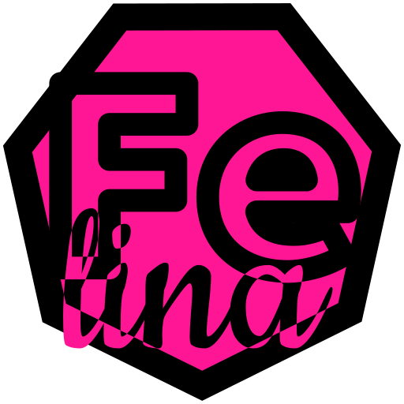

*Welcome to my site!* Bienvenidos, internautas, a mi sitio web.

Mi nombre es Felina Andrea Rivera Calzadillas.

I am Felina Andrea Rivera Calzadillas.

- [felina.art](https://felina.art)
- [felina.cloud](https://felina.cloud)
- [FeLiNa0 on GitHub](https://github.com/FeLiNa0)
- [LinkedIn](https://linkedin.com/in/felina-andrea)
- felina åt felina.cloud
- felina ąt felina.art

## Name

Some girls are made of sugar and spice, some are made of **Fe**rrite, **Li**thium, and **Na**trium. Iron, Lithium, Sodium. Blood, neurodivergence, and sweat.

My full name is Felina Andrea Rivera Calzadillas. I prefer the Spanish pronunciation.

I use Felina A. Rivera for the sake of conciseness and memorability.

Many institutions are unaware of or unwilling to accommodate the rich diversity of personal names around the world; therefore, I may also use:

- Felina Rivera
- Felina Andrea Rivera
- Felina A. Rivera Calzadillas
- Rivera Calzadillas

This article from the [W3C](https://www.w3.org/) describes how computers *should* be reading and storing names: ["How do people's names differ around the world, and what are the implications of those differences on the design of forms, databases, ontologies, etc. for the Web?"](https://www.w3.org/International/questions/qa-personal-names)

My name is not Celina Rivera Calzadillas or Merlina Rivera Calzadillas or Melina Rivera Calzadillas or Evelina Rivera Calzadillas or Selina Rivera Calzadillas, but they're listed here to avoid confusion.

## Posts

<ul>
  
    <li>
      <h3><a href="{{ post.url }}">{{ post.title }}</a></h3>
      
<a href="{{ post.url }}">{{ post.date | date_to_long_string }}</a>

      
{{ post.excerpt }} <a href="{{ post.url }}">(view more)</a>

    </li>
  
</ul>   

<footer>

Felina A. Rivera Calzadillas. The opinions expressed herein are my own and do not represent my employer’s views in any way. Written using Martanne's Vis editor and conveniently deployed with GitHub pages.

</footer>
